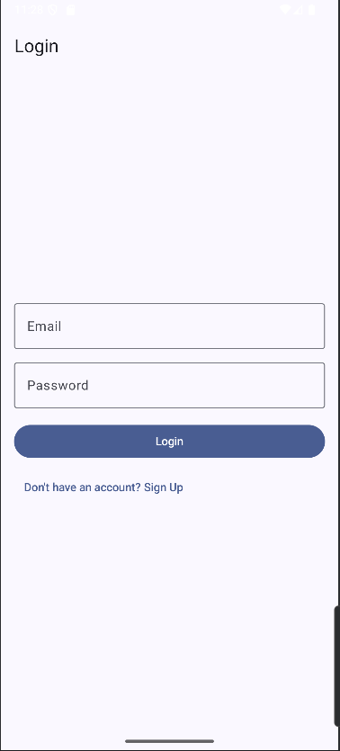
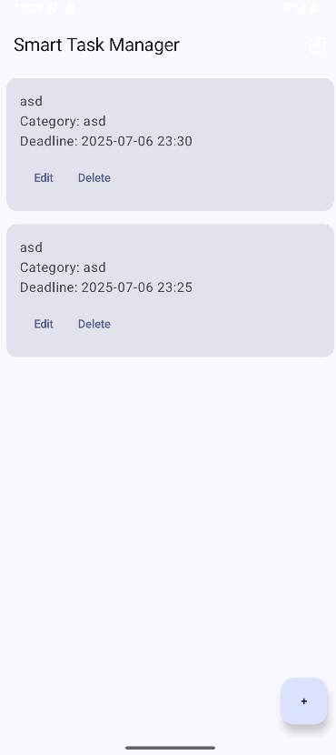
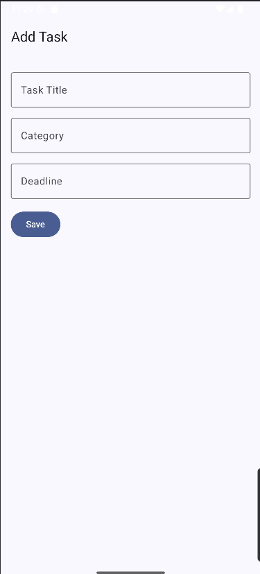

# 🧠 Smart Task Manager

A powerful and modern Android app to help users manage their daily tasks and productivity with ease. Built with **Kotlin**, **Jetpack Compose**, **Firebase Authentication**, and **Room Database**, this app allows you to organize, track, and complete tasks efficiently.

---

## 📱 Features

- 🔐 **Google Sign-In** for secure login
- 📝 **Add, Edit, and Delete Tasks**
- ⏰ **Due Dates & Reminders**
- 🧩 **Task Categories**
- ☁️ **Cloud Sync (optional for user data)**

---

## 🚀 Screenshots

> _Include app screenshots here_  
> , , 

---

## 🛠️ Tech Stack

- **Language:** Kotlin
- **UI:** Jetpack Compose, Material 3
- **Architecture:** MVVM (Model-View-ViewModel)
- **Navigation:** Jetpack Navigation
- **Backend:** Firebase Authentication (Google Sign-In)
- **Notification Support:** Android 13+ compatible

---

## 🔧 Setup Instructions

1. **Clone the Repository**

```bash
git clone https://github.com/AhmadShykh/Smart-Task-Manager.git
cd Smart-Task-Manager
